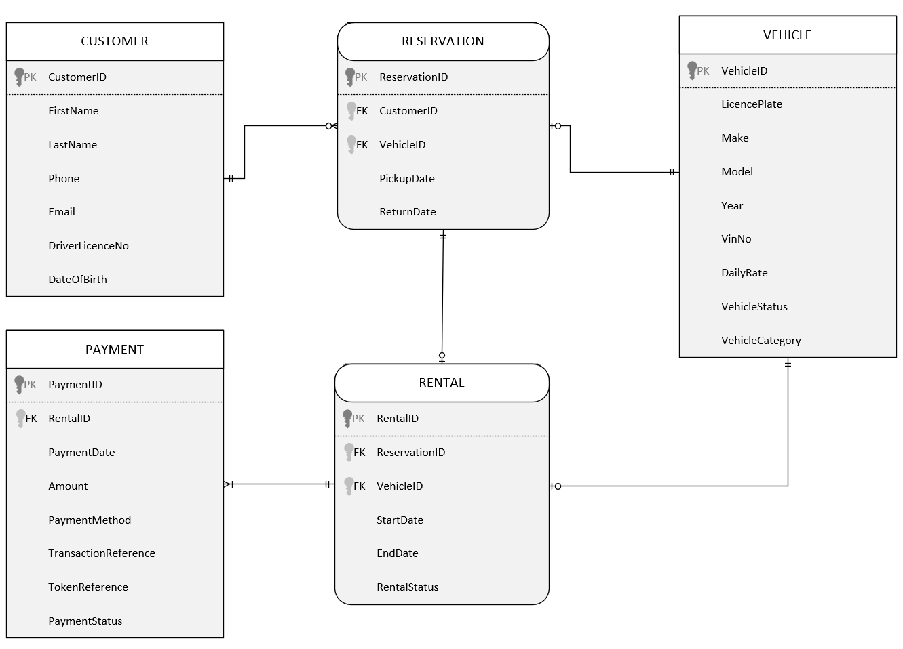
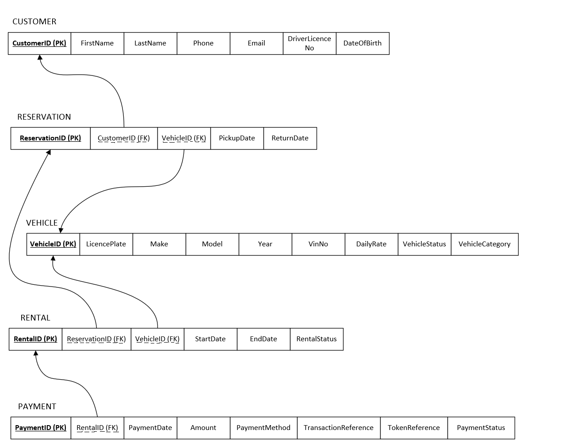

# Car Rental Service Database

A relational database design and implementation for a car rental service, built for **MIS 632 – Database Analysis and Design for Business** (Master of Science in Business Analytics, Drexel University, Spring 2026).

The system models the full rental lifecycle — customer registration, vehicle inventory, reservations, active rentals, and payment processing — and demonstrates how a normalized schema can answer real operational questions around fleet performance, customer retention, and payment risk.

## Team

- Luan Nguyen
- Auspicious Munemo
- Bradley Chikwavarara
- Benjamin Tawiah
- Mirlan Ulanov

## Project overview

Car rental businesses need to track a fleet of vehicles, manage customer records, coordinate reservations against availability, convert reservations into active rentals, and reconcile payments — all while enforcing rules like "a vehicle can't be double-booked." This project analyzes those requirements and translates them into an Entity-Relationship model, a normalized relational schema, and a working Oracle database populated with sample data.

**Core entities:**

| Entity | Purpose |
|---|---|
| **Customer** | Individuals who rent vehicles — identity, contact info, and driver's license details required for rental agreements. |
| **Vehicle** | The rental fleet — make, model, year, VIN, daily rate, status (available / rented / maintenance), and category (economy, SUV, luxury, etc.). |
| **Reservation** | A hold placed by a customer on a specific vehicle for a future date range. |
| **Rental** | The actual, active use of a vehicle once a reservation is fulfilled — start/end dates and rental status. |
| **Payment** | One or more financial transactions tied to a rental — method, amount, transaction/token references, and status. |

**Key business rules:**

- A reservation belongs to exactly one customer and one vehicle; a customer may have zero or many reservations.
- A reservation may result in zero or one rental; every rental must trace back to exactly one reservation.
- A rental may generate one or many payments (e.g. a deposit and a final charge); every payment belongs to exactly one rental.
- Vehicle status must reflect current availability (available / rented / maintenance).
- Driver's license number and date of birth are captured for legal compliance and age verification.

## Entity-Relationship Diagram

## Relational Schema

| Table | Primary Key | Foreign Keys | Notable Columns |
|---|---|---|---|
| `Customer_T` | `CustomerID` | — | FirstName, LastName, Phone, Email, DriverLicenceNo, DateOfBirth |
| `Vehicle_T` | `VehicleID` | — | LicencePlate, Make, Model, Year, VinNo, DailyRate, VehicleStatus, VehicleCategory |
| `Reservation_T` | `ReservationID` | CustomerID → Customer_T, VehicleID → Vehicle_T | PickupDate, ReturnDate |
| `Rental_T` | `RentalID` | ReservationID → Reservation_T, VehicleID → Vehicle_T | StartDate, EndDate, RentalStatus |
| `Payment_T` | `PaymentID` | RentalID → Rental_T | PaymentDate, PaymentMethod, Amount, TransactionReference, TokenReference, PaymentStatus |

Each table uses an Oracle sequence and a `BEFORE INSERT` trigger to auto-generate readable, prefixed primary keys (e.g. `CAR-2026-0001` for vehicles, `RES-000001` for reservations, `RNT-XXXXXX` for rentals).

## Business questions answered

The database was validated against three business questions, each backed by a SQL query in the project report.

### 1. Fleet utilization & revenue optimization
*Which vehicles are most frequently rented vs. sitting idle, and how does that affect revenue?*

Joins `Vehicle_T` → `Rental_T` → `Payment_T`, grouping by vehicle to rank rental count and total revenue. Uses `GROUP BY` and multi-table joins to show that rental frequency and revenue don't always move together — some vehicles earn more from fewer, higher-rate rentals.

### 2. Customer behavior & retention
*Who are the most valuable repeat customers, and what rental patterns define them?*

Joins `Customer_T` → `Reservation_T` → `Rental_T` → `Vehicle_T` → `Payment_T` to build a per-customer profile of total rentals, total spend, average rental duration, and preferred vehicle category — useful for identifying loyalty and promotion targets.

### 3. Operational risk & payment reliability
*Which rentals carry the highest risk of late or missing payment?*

A `LEFT JOIN` between `Rental_T` and `Payment_T` classifies every rental as `ON TIME`, `LATE PAYMENT`, or `NO PAYMENT` by comparing payment date to rental end date — surfacing collection risk at the transaction level.

Full SQL statements and result-level insights for all three queries are in the project report.

## Repository contents

| File | Description |
|---|---|
| `TableCreationScripts.sql` | DDL — drops and recreates all five tables, sequences, and ID-generation triggers with primary/foreign key constraints. |
| `DataCreationScripts.sql` | Seeds each table with 100 generated sample records. |
| `UpdateData.sql` | Post-seed refinement — assigns realistic vehicle models/categories by make, derives rental dates from reservation dates, and recalculates daily rates and payment amounts. |
| `customerdata.csv` / `res_cust_map.csv` | Supporting sample data used while populating the customer and reservation tables. |
| `ERD Drawing.vsdm` | Editable Visio source for the ER diagram. |
| `MIS632_ProjectDescription.pdf` | Original assignment brief. |
| `MIS 632 – Database Analysis and Design for Business.docx` | Full project report — requirements analysis, ER model, relational schema, business questions, SQL, and results. |

## Data note

All customer, vehicle, and transaction data in this project (names, emails, VINs, payment references, etc.) is synthetically generated using Oracle's `DBMS_RANDOM` package and sample CSVs — no real customer or business data is used.

## Tech stack

- **Database:** Oracle (developed and deployed in Oracle APEX)
- **Language:** PL/SQL (DDL, DML, sequences, triggers)
- **Diagramming:** Microsoft Visio
